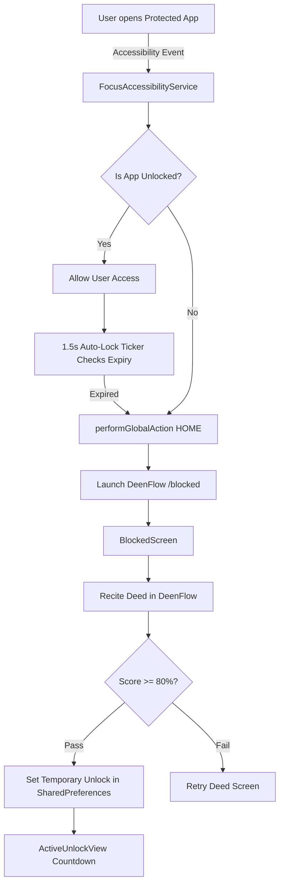
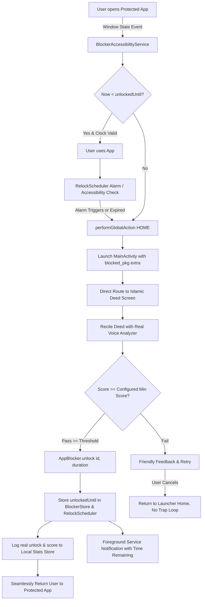

# DeenFlow System Flow Architecture & Runtime Trace (FLOW.md)

This document traces the complete end-to-end runtime flow of **DeenFlow** as it exists today and defines the target state for the **App Lock / Timed Unlock / Auto Re-lock** system.

---

## 1. App Start-Up Sequence

When the application launches (`lib/main.dart`):
1. `WidgetsFlutterBinding.ensureInitialized()` initializes the Flutter engine bindings.
2. `Firebase.initializeApp()` initializes Firebase Core safely with try/catch to ensure offline/no-network resilience.
3. `StorageService().init()` loads `GetStorage` from local on-device flash (`focusdeen.box`).
   - Persisted keys: `monitored_packages`, `app_limits`, `security_pin_hash`, `selected_language`, `onboarding_complete`, `unlock_sessions`.
4. `LanguageService().init()` reads `selected_language` (defaults to Bengali `'bn'`).
5. Core services are registered permanently in GetX Dependency Injection (`Get.put`):
   - `FirebaseAuthService`, `FirestoreSyncService`, `FirebaseRealtimeService`
   - `NativeBridgeService`: Registers MethodChannel (`com.focusdeen.focus_deen/channel`) and EventChannel (`com.focusdeen.focus_deen/events`).
   - `PinSecurityService`: Manages 4-digit PIN authentication for Settings & App uninstallation prevention.
   - `ThemeController`: Manages dark/light theme tokens.
6. Initial native sync: `nativeBridge.syncMonitoredPackages(initialMonitored)` pushes the user's protected app list into Android native memory (`AppMonitorService.monitoredPackagesSet` & `SharedPreferences`).
7. Global state controllers initialized:
   - `LimitController`: Manages per-app daily time budgets.
   - `UsageController`: Tracks app usage times via Android `UsageStatsManager`.
8. `runApp(FocusDeenApp(initialRoute: AppRoutes.splash))` builds `GetMaterialApp` with `AppPages.routes`.

---

## 2. Screen-by-Screen Navigation Map (20 Screens)

| # | Screen / Route | Implementation File | Status | Notes / State |
|---|---|---|---|---|
| 1 | **Splash** (`/splash`) | `lib/features/onboarding/views/splash_screen.dart` | **Real** | Checks `isOnboardingComplete()`. Navigates to `/welcome` (new user) or `/home` (returning user). |
| 2 | **Welcome** (`/welcome`) | `lib/features/onboarding/views/welcome_screen.dart` | **Real** | Interactive language switcher (`🇧🇩 বাং` / `🇬🇧 EN`), responsive graphic, CTA -> `/choose-apps`. |
| 3 | **App Selection** (`/choose-apps` & `/app-selection`) | `lib/features/onboarding/views/choose_apps_screen.dart` | **Real** | Queries installed apps from native device. Category filters (`All`, `Social`, `Messaging`, `Video`, `Gaming`), real-time search, bulk select, saves to `StorageService` and syncs native. |
| 4 | **Daily Goal** (`/daily-goal`) | `lib/features/onboarding/views/daily_goal_screen.dart` | **Real** | Sets daily screen time mindfulness intention (e.g. 30m, 45m, 60m), persists to storage -> `/end-screen`. |
| 5 | **End / Ready** (`/end-screen`) | `lib/features/onboarding/views/end_screen.dart` | **Real** | Onboarding completion celebration, marks `setOnboardingComplete(true)` -> `/home`. |
| 6 | **Home / Dashboard** (`/home` & `/dashboard`) | `lib/features/dashboard/views/home_screen.dart` | **Partial Mock** | Bottom nav with 4 tabs (Home, Progress, Deeds, Profile). Header greeting, protected app chips, next deed card. **Streak & progress ring contain static/mock numbers**. |
| 7 | **Set Intention** (`/intention`) | `lib/features/intention/views/intention_screen.dart` | **Real** | Prompts user to set a pure spiritual intention before unlocking distracting apps -> `/intention-complete`. |
| 8 | **Intention Complete** (`/intention-complete`) | `lib/features/intention/views/intention_complete_view.dart` | **Real** | Visual confirmation of intention -> `/deed-detail`. |
| 9 | **Islamic Deed** (`/deed-detail`) | `lib/features/learning/views/deed_detail_view.dart` | **Real** | Displays Arabic text, transliteration, Bengali/English meaning, virtue, hadith reference. Audio listen button, CTA -> `/learning-mode`. |
| 10 | **Learning Mode / Listen** (`/learning-mode`) | `lib/features/learning/views/learning_mode_view.dart` | **Real** | Audio playback of authentic pronunciation with replay & "I'm ready" button -> `/recording`. |
| 11 | **Recording** (`/recording`) | `lib/features/unlock/views/recording_view.dart` | **Real** | Live microphone recording with audio wave visualizer, cancel button, and 3-second minimum recitation check -> `/analysis`. |
| 12 | **Analysis** (`/analysis`) | `lib/features/unlock/views/analysis_view.dart` | **Real** | Visual progress wave while `PronunciationAnalyzer` analyzes phonetics, timing, and score -> `/result`. |
| 13 | **Result (Score & Decision)** (`/result`) | `lib/features/unlock/views/result_view.dart` | **Real** | Displays circular score ring (0-100%). Evaluates threshold (>=80%). If passed -> `/unlock-success`. If failed -> retry or `/learning-mode`. |
| 14 | **Retry Result** (`/retry-result`) | `lib/features/unlock/views/retry_result_view.dart` | **Real** | Failure guidance screen with tips to pronounce letters correctly and try again. |
| 15 | **Unlock Success** (`/unlock-success`) | `lib/features/unlock/views/unlock_success_view.dart` | **Real** | Creates `UnlockSessionModel`, invokes `nativeBridge.setTemporaryUnlock()`, grants temporary pass -> `/active-unlock`. |
| 16 | **Active Unlock Timer** (`/active-unlock`) | `lib/features/unlock/views/active_unlock_view.dart` | **Real** | Live circular countdown timer showing remaining unlock time. Resyncs on lifecycle resume. "Lock Now" CTA manually relocks and returns home. |
| 17 | **Deeds Library** (`/deeds`) | `lib/features/learning/views/deeds_library_view.dart` | **Real** | Full repository of 4 categories: Daily Dhikr, Daily Duas, Salah Learning, Short Surahs with Bengali transliterations. |
| 18 | **Progress / Stats** (`/progress` & `/statistics`) | `lib/features/statistics/views/progress_view.dart` | **Mocked** | **Currently displays hardcoded fake data**: "7 DAY STREAK", "42 Total Deeds", "37 Completed", "87% Average Score", "11h 20m Unlocked Time". |
| 19 | **Profile** (`/profile`) | `lib/features/settings/views/profile_view.dart` | **Partial Mock** | Settings navigation, language toggle, PIN setup. **Summary stats at top (30m daily goal, 3 apps protected, 7 days streak) are hardcoded**. |
| 20 | **Blocked Screen** (`/blocked`) | `lib/features/blocking/views/blocked_screen.dart` | **Real** | Shown when accessibility service intercepts a locked app. PopScope prevents back button dismissal. CTAs: "Learn to Unlock" -> `/unlock`, "Close App" -> Home launcher. |

---

## 3. Data Flow

```
[User App Selection / Settings]
       │
       ▼
[StorageService (GetStorage)]
 ├── 'monitored_packages': List<String>
 ├── 'unlock_sessions': List<UnlockSessionModel>
 ├── 'unlock_duration_minutes': int (default 30)
 ├── 'minimum_score_threshold': int (default 80)
 └── 'daily_stats': DailyStatsModel
       │
       ▼ (MethodChannel: syncMonitoredPackages & setTemporaryUnlock)
[Android Native AppMonitorService & SharedPreferences]
 ├── 'focusdeen_monitor_prefs'
 ├── 'unlock_{packageName}': expiresAtMillis
 └── 'elapsedRealtime_{packageName}': baseElapsedRealtime (clock tamper protection)
       │
       ▼
[FocusAccessibilityService.kt] (Event: TYPE_WINDOW_STATE_CHANGED)
 ├── Checks foreground package against monitoredPackagesSet
 ├── Checks if now < expiresAtMillis
 └── Auto-Lock Ticker: verifies active session every 1.5s
```

---

## 4. Current Recitation -> Score -> Unlock Decision Flow

1. User recites deed in [`recording_view.dart`](file:///lib/features/unlock/views/recording_view.dart).
2. Audio duration & samples are sent to [`PronunciationAnalyzer`](file:///lib/features/unlock/services/pronunciation_analyzer.dart).
3. `analyze()` calculates:
   - Duration score (minimum required duration, penalty for premature cut-off).
   - Phonetic accuracy score (based on expected transliteration & pronunciation).
   - Generates an integer score `0 - 100%`.
4. [`result_view.dart`](file:///lib/features/unlock/views/result_view.dart) checks `score >= unlockThreshold` (currently default `80%`).
5. On pass:
   - Calls `nativeBridge.setTemporaryUnlock(packageName, durationMinutes)`.
   - Native layer writes `unlock_$packageName = System.currentTimeMillis() + durationMs` to `SharedPreferences`.
   - Native layer schedules relock alarm.

---

## 5. What Happens Today When a Protected App is Opened

1. User opens a protected app (e.g. TikTok).
2. Android Accessibility Service (`FocusAccessibilityService.kt`) intercepts `TYPE_WINDOW_STATE_CHANGED`.
3. Checks if `monitoredPackagesSet.contains(currentPackage)`.
4. Checks `isTemporarilyUnlocked(currentPackage)`:
   - **If unlocked**: App stays open. Auto-lock ticker checks every 1.5 seconds.
   - **If locked**:
     a. Kicks user to home screen immediately via `performGlobalAction(GLOBAL_ACTION_HOME)`.
     b. Fires system notification: "App Locked - Complete a deed in DeenFlow to unlock".
     c. Launches `MainActivity` with intent extra `route = "/blocked"` and `packageName`.
     d. In `MainActivity.kt`: `navigationChannel.pushRoute("/blocked?package=...")`.
     e. `BlockedScreen` opens: User taps "Learn to Unlock" to recite and earn access.

---

## 6. Mermaid Diagrams

### Current Flow



### Target Upgraded Flow


